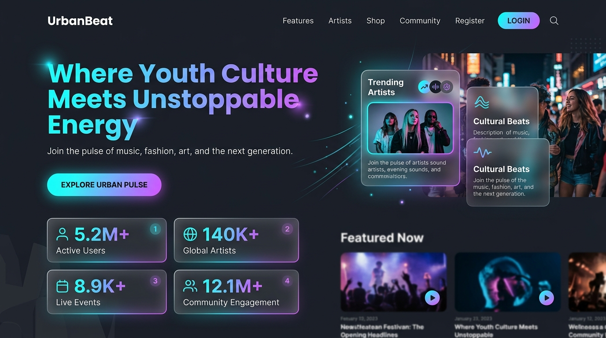
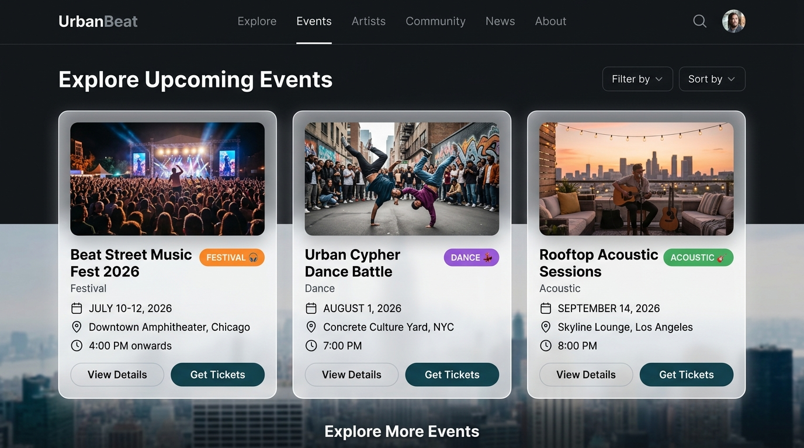
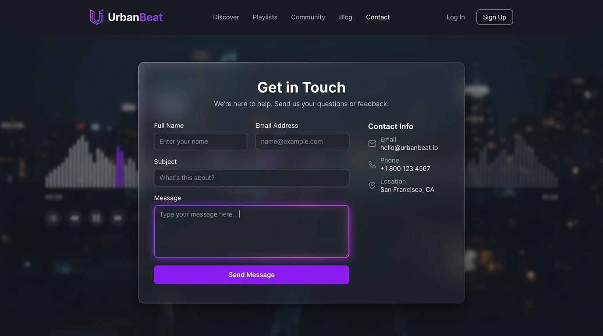
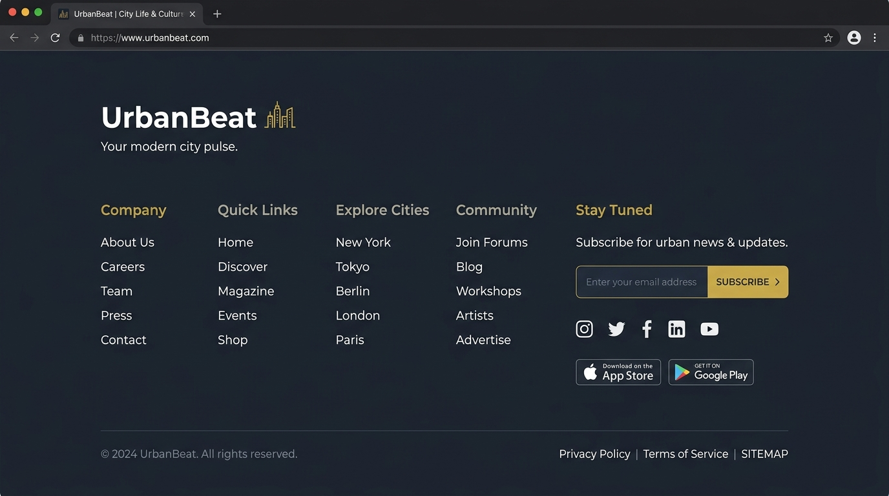

# ⚡ UrbanBeat — Youth Culture & Event Discovery Platform

🌐 Live Demo:  
https://urbanbeat-wordpress.vercel.app

💻 GitHub Repository:  
https://github.com/Shilpa805/urbanbeat-wordpress

---

## 📖 Project Overview

Developed UrbanBeat during my internship at Inglu as a modern youth culture and event discovery platform. Built with modern HTML5, CSS3 glassmorphism design tokens, ES6+ JavaScript, and Web3Forms form backends, this project showcases clean responsive web engineering and portfolio-ready user experience design.

---

## 📸 Website Screenshots

### Hero Section


### Upcoming Events Section


### Contact Form Section


### Multi-Column Footer


---

## ✨ Features

- 🎨 **Glassmorphism Dark Design System**: Custom CSS variables with glowing indigo/purple/cyan accents and `Outfit` / `Inter` Google Fonts.
- ⚡ **Sticky Header & Mobile Drawer**: Header shrinks on scroll with `backdrop-filter: blur(16px)` and an accessible mobile toggle.
- 🚀 **IntersectionObserver Animations**: Scroll-triggered section reveals (`.ub-reveal`) for smooth 60fps animations.
- 📅 **Interactive Event Cards**: CSS Grid layout with image aspect ratios, category badges, and RSVP CTAs.
- 📩 **Web3Forms Asynchronous Submissions**: Contact form and newsletter forms submit asynchronously via `fetch()` API with client-side validation, loading indicators, and instant email delivery.
- ♿ **WCAG Accessibility & Performance**: `<link rel="preconnect">` font hints, `loading="lazy"` images, keyboard `:focus-visible` rings, and ARIA landmarks.

---

## 🛠️ Tech Stack

- **Frontend**: HTML5, Modern CSS3 (Custom Properties, Glassmorphism, CSS Grid, Flexbox), JavaScript ES6+
- **Form Backend**: Web3Forms API
  - Contact form submissions are powered by Web3Forms (`fetch()` API).
  - Newsletter subscriptions are powered by Web3Forms (`fetch()` API).
- **CMS / Theme Layer**: WordPress 6.8+ & PHP 8.2 (`hello-elementor` theme structure)
- **Deployment**: Vercel & GitHub

---

## 📂 Project Folder Structure

```
urbanbeat/
├── app/
│   └── public/                       # WordPress & Static Project Root
│       ├── screenshots/              # Project Screenshot Assets
│       │   ├── hero.png
│       │   ├── events.png
│       │   ├── contact.png
│       │   └── footer.png
│       ├── wp-content/
│       │   ├── themes/
│       │   │   └── hello-elementor/  # Theme Directory
│       │   │       ├── assets/
│       │   │       │   ├── css/
│       │   │       │   │   └── urbanbeat-custom.css  # Design System & Utility Styles
│       │   │       │   └── js/
│       │   │       │       └── urbanbeat-main.js    # Scroll, Drawer & Web3Forms JS
│       │   │       ├── template-parts/
│       │   │       │   ├── header.php         # Sticky Glass Header & Mobile Nav
│       │   │       │   ├── footer.php         # Multi-Column Footer
│       │   │       │   ├── hero.php           # Hero Banner, Stats Grid & Cards
│       │   │       │   ├── single.php         # Page Content Template
│       │   │       │   └── archive.php        # Blog & Event Archive Grid
│       │   │       ├── functions.php          # Enqueue Script & Styles
│       │   │       └── style.css              # Theme Header Metadata
│       ├── index.html                        # Native Production HTML Entry Point
│       ├── .gitignore                        # Git Filter Rules
│       ├── README.md                          # Project Documentation & Case Study
│       └── wp-config.php                     # WordPress Configuration File
```

---

## 📦 Local Installation & Setup

1. **Clone the Repository**:
   ```bash
   git clone https://github.com/Shilpa805/urbanbeat-wordpress.git
   ```
2. **Run Local Server**:
   ```bash
   php -S 127.0.0.1:8000 -t ./app/public
   ```
3. **Access in Browser**: Open `http://127.0.0.1:8000`.

---

## 📄 Resume & LinkedIn Showcase Snippet

**Web Development Intern — Inglu**
- Developed UrbanBeat during my internship at Inglu as a modern youth culture and event discovery platform.
- Designed a dark glassmorphism UI system using CSS custom properties, ES6+ JavaScript, and responsive CSS Grid.
- Integrated Web3Forms API via `fetch()` for asynchronous contact form submissions and newsletter subscriptions with client-side validation and loading states.
